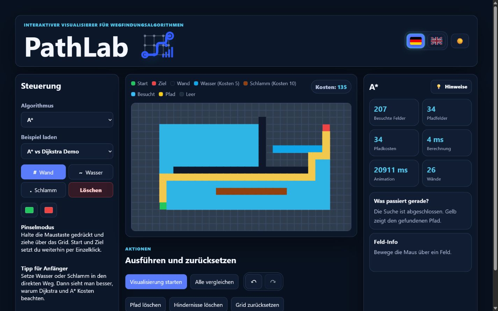

# PathLab

[Deutsch](./README.md) | **English**

PathLab is an interactive visualizer for learning and comparing pathfinding algorithms on a weighted grid. The project is presented as a stable IMS portfolio project and demonstrates algorithms, UI state, animations, internationalization, and automated tests in a compact React application.

- Live demo: [https://alekszyro.github.io/PathLab/](https://alekszyro.github.io/PathLab/)
- User guide: [English beginner guide](USER_GUIDE_EN.md)



## Project Status

Current status: **stable portfolio version**.

The application is published with GitHub Pages. GitHub Actions has successfully run `npm ci`, `npm test`, and `npm run build`.

## Main Features

- interactive grid with start and target nodes
- tools for walls, water, mud, and erase
- weighted cells with fixed costs: normal 1, water 5, mud 10
- animated search visualization
- BFS, DFS, Dijkstra, and A*
- comparison of all algorithms on the same grid
- path cost breakdown
- separate calculation time and animation time
- undo and redo for grid edits
- prepared example scenarios
- German and English content
- light and dark mode

## Algorithms

- **BFS** searches layer by layer and finds the shortest path by number of steps on unweighted grids.
- **DFS** demonstrates depth-first search, but does not guarantee the shortest or cheapest path.
- **Dijkstra** considers cell costs and finds the cheapest path.
- **A\*** also considers cell costs and adds a Manhattan distance estimate toward the target.

Dijkstra and A* currently use simple array sorting for open nodes. This implementation is sufficient for the fixed educational grid, but it is not optimized for very large graphs.

## Tech Stack

- React 19
- JavaScript
- Vite
- CSS
- Vitest
- GitHub Actions
- GitHub Pages

## Installation

```bash
npm install
```

## Development and Production Build

Start the development server:

```bash
npm run dev
```

Create a production build:

```bash
npm run build
```

Preview the production build locally:

```bash
npm run preview
```

## Tests

```bash
npm test
```

The automated GitHub Actions check runs:

```bash
npm ci
npm test
npm run build
```

The tests cover, among other things:

- unreachable targets
- weighted water and mud cells
- cost breakdowns
- A* compared with Dijkstra
- restoration of terrain types after search overlays
- start and target nodes
- undo and redo stack logic

## Project Structure

```text
src/
  algorithms/
    pathfinding.js
    pathfinding.test.js
  components/
    ActionPanel.jsx
    ComparePanel.jsx
    Controls.jsx
    GridBoard.jsx
    LanguageSwitch.jsx
    Onboarding.jsx
    PathLabLogo.jsx
    StatsPanel.jsx
  i18n/
    de.json
    en.json
  utils/
    grid.js
    grid.test.js
    history.js
    history.test.js
    presets.js
    sound.js
  App.jsx
  main.jsx
docs/
  screenshots/
```

## Technical Decisions

- The algorithms are separated from the React components so they can be tested independently.
- Terrain costs are maintained centrally in `src/utils/grid.js`.
- Search overlays remember the previous terrain type so water and mud can be restored after the animation.
- Calculation time and animation time are handled separately. The animation is intentionally slowed down and is therefore not algorithm runtime.
- Undo and redo use small history helpers in `src/utils/history.js`, which makes the stack logic testable in isolation.
- Deployment is handled with GitHub Pages.

## Known Limitations

- Dijkstra and A* use array sorting instead of a priority queue.
- The grid has a fixed size and is designed as a learning environment.
- Screenshots need to be updated manually when the UI changes.

## Screenshot Section

The screenshot is stored at [docs/screenshots/pathlab-overview.png](./docs/screenshots/pathlab-overview.png) and shows an A* example with weighted cells, obstacles, the found path, and visible controls.

## Demo Section

The live demo is published with GitHub Pages:

[https://alekszyro.github.io/PathLab/](https://alekszyro.github.io/PathLab/)

A separate demo video is currently not included in the repository. The live demo and the current screenshot cover the most important portfolio impression.

## Documentation

- [German user guide](BENUTZERANLEITUNG_DE.md)
- [English beginner guide](USER_GUIDE_EN.md)

## License

This project is published under the MIT License. See [LICENSE](./LICENSE) for details.
